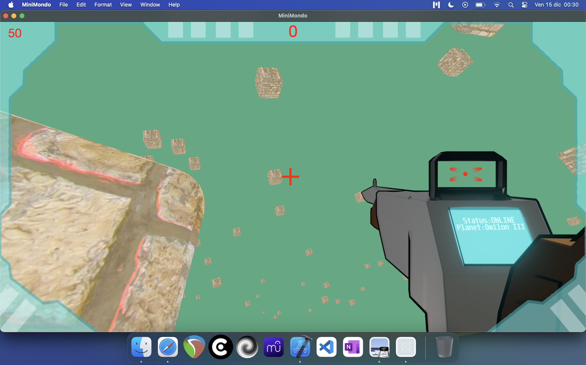
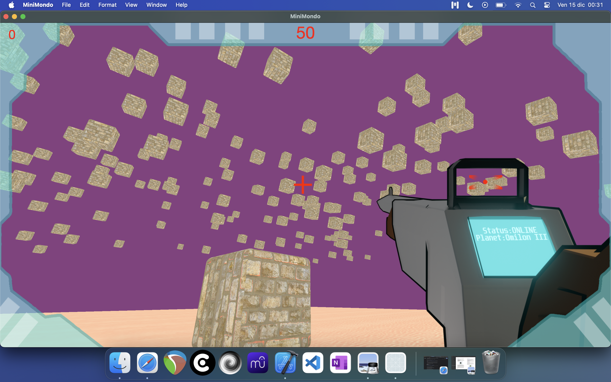

# MiniMondo - Basic 3D Engine with Metal

MiniMondo is a lightweight 2D/3D engine built in Metal, designed as a proof-of-concept for a university project. The engine is not a commercial product but serves as a base for understanding graphics programming with Metal and building simple interactive 3D applications.

## Overview

This project demonstrates:

- Easy integration of 2D and 3D scenes
- Scene-specific lighting using the Phong model
- Multiple camera types (perspective and orthographic) and easy camera setup
- Support for textures, materials, and external models
- Each object has its own rendering pipeline, allowing different shaders for different objects
- Simple user input management

### Notes

- Lighting supports directional, spot, and point lights
- Rendering is currently single-pass, so advanced features like shadows or particle effects are not implemented
- This is my first attempt at building a graphics engine with this level of complexity, so some limitations are expected

## Demo Game

A simple demo game is included to showcase the engine:

- Players move in a 3D space, able to walk, run, and jump
- Cubes move randomly in the sky
- Players aim and shoot cubes
- Goal: hit as many cubes as possible

### Screenshots

  
  
  

*Example: testing 2D integration within a 3D space*

## Resources & References

These sources helped guide the development of MiniMondo:

- Jamie King – OpenGL Playlist: [YouTube](https://youtu.be/6c1QYZAEP2M?feature=shared)
- The Cherno – OpenGL series: [YouTube](https://youtu.be/W3gAzLwfIP0?feature=shared)
- Metal tutorials:
  - [Metal Direct Series 1](https://youtu.be/zdKQ-I8o1GQ?feature=shared)
  - [Metal Engine Tutorial Series](https://youtu.be/PcA-VAybgIQ?feature=shared)
- Books:
  - *Metal Programming Guide* (Janie Clayton)
  - *Metal by Example* (Warren Moore)
  - *Metal by Tutorials* – [Kodeco link](https://www.kodeco.com/books/metal-by-tutorials/v2.0) (recommended)

## Repository

The engine code can be found at: [MiniMondo GitHub](https://github.com/GraphicAudioCoder/MiniMondo)
